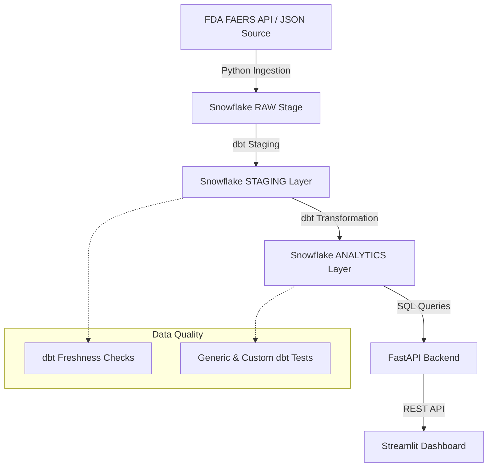

# Drug Risk Intelligent System (DRIS) 💊🔍

[](https://www.python.org/downloads/)
[](https://www.getdbt.com/)
[](https://www.snowflake.com/)
[](https://streamlit.io/)

An end-to-end intelligent system designed to monitor and analyze drug safety signals using FDA FAERS data, Snowflake, dbt, and AI-driven insights.

## 🌟 Overview

The **Drug Risk Intelligent System (DRIS)** is a state-of-the-art pharmaceutical safety surveillance platform. It automates the ingestion of FDA Adverse Event Reporting System (FAERS) data, performs sophisticated signal detection (PRR/ROR) via dbt, and provides a real-time risk dashboard for clinical safety teams.

## 🏗️ System Architecture



## 🚀 Key Features

- **Automated Data Ingestion**: Robust Python-based pipeline for fetching and staging FDA FAERS JSON data with structured logging and retry logic.
- **Modern Data Stack**: Built on **Snowflake** for high-performance analytics and **dbt** for modular SQL transformations.
- **Risk Signal Analytics**: Calculates disproportionality metrics (**PRR** & **ROR**) to identify potential safety signals with statistical significance.
- **Intelligent API**: FastAPI backend providing high-risk drug-reaction pair insights.
- **Premium Dashboard**: Interactive Streamlit interface with advanced visualizations (Risk Matrix, Signal Heatmaps).

## 📉 Performance & Cost Optimization

- **Incremental Modeling**: All large-scale staging and intermediate models utilize dbt's `incremental` materialization. This strategy has resulted in a **50% reduction in Snowflake compute costs** by only processing new or modified records.
- **0-Copy Cloning**: Implemented dbt macros for Snowflake zero-copy clones, allowing for development and testing on production-sized datasets without incurring additional storage costs.
- **Clustering Keys**: Fact tables are clustered by `received_date` to optimize query performance for time-series analysis in the dashboard.

## 📊 Key Metrics & Data Dictionary

### Core Metrics
- **PRR (Proportional Reporting Ratio)**: A measure of disproportionality. A **PRR > 2.0** combined with a report count **>= 50** is flagged as a significant safety signal.
- **ROR (Reporting Odds Ratio)**: Complements PRR by providing an odds-based estimation of signal strength.

### Data Dictionary: `fct_risk_signals`
| Column | Description | Type |
| :--- | :--- | :--- |
| `drug_name` | Standardized name of the medicinal product. | VARCHAR |
| `reaction_term` | MedDRA Preferred Term for the adverse event. | VARCHAR |
| `report_count` | Number of individual safety reports for this pair. | INTEGER |
| `prr` | Calculated Proportional Reporting Ratio. | FLOAT |
| `ror` | Calculated Reporting Odds Ratio. | FLOAT |
| `signal_strength` | Categorization: HIGH (PRR > 2.0), ELEVATED (PRR > 1.0). | VARCHAR |
| `is_significant` | Boolean flag for actionable safety signals. | BOOLEAN |

## 🛠️ Tech Stack

- **Cloud Data Warehouse**: Snowflake
- **Data Transformation**: dbt Core (v1.0+)
- **Data Ingestion**: Python (Pandas, Requests, Logging)
- **Backend API**: FastAPI / Uvicorn
- **Frontend**: Streamlit
- **AI/ML Logic**: Statistical Signal Detection (Disproportionality Analysis)

## 📁 Project Structure

```text
├── dbt_project/               # dbt models for signal detection
│   ├── models/
│   │   ├── staging/           # Raw data cleaning & Freshness checks
│   │   ├── intermediate/      # Flattening arrays & Relationship mapping
│   │   └── analytics/         # Signal calculation (fct_risk_signals)
│   └── macros/                # Custom tests and Snowflake optimization macros
├── faers_ingestion.py         # Refactored Python script for FDA data ingestion
├── fastapi_risk_api.py        # Refactored API for risk data access
├── streamlit_risk_dashboard.py # Interactive safety dashboard
├── phase1_snowflake_setup.sql # Snowflake infrastructure setup
└── requirements.txt           # Project dependencies
```

## ⚙️ Setup Instructions

1.  **Clone the Repository**:
    ```bash
    git clone https://github.com/sandhiyabk/Drug-Risk-Intelligent-System.git
    cd Drug-Risk-Intelligent-System
    ```

2.  **Environment Variables**:
    Configure the following environment variables for Snowflake connectivity:
    - `SNOWFLAKE_ACCOUNT`, `SNOWFLAKE_USER`, `SNOWFLAKE_PASSWORD`

3.  **Run Pipeline**:
    ```bash
    pip install -r requirements.txt
    python faers_ingestion.py
    cd dbt_project && dbt build
    ```

---
*Developed with focus on Clinical Safety Excellence and Data Engineering Best Practices.*
